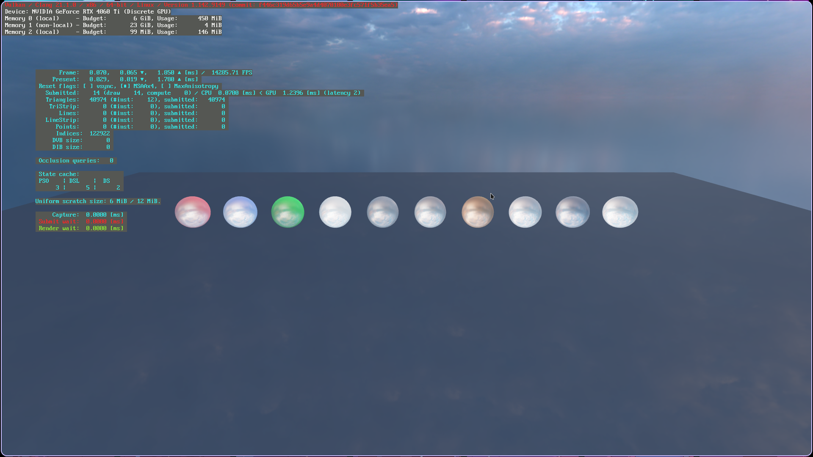

# Qaya

A data-driven, modular application framework and game engine in Zig.



## Core Concepts

**Everything is data.** Qaya doesn't have game objects. It has entities -- lightweight handles that carry components (plain structs). Systems iterate over those components and mutate them. This is the Entity Component System pattern, and it runs through everything.

**Components are any struct type.** No registration, no macros, no boilerplate. Component IDs are derived at comptime from `@typeName` using Fnv1a-64, mapped to 2048-bit masks. Collisions are detected at runtime in debug builds.


```zig
const Velocity = struct { x: f32, y: f32 };
const Position = struct { x: f32, y: f32 };

var world = World.init(allocator, io);
const e = try world.spawn(.{ Position{ .x = 0, .y = 0 } });
try world.addComponent(e, Velocity, .{ .x = 1, .y = 2 });
```

**Systems are plain functions** that declare their parameters. The ECS introspects the parameter types at comptime to extract read/write masks and wire up dependencies automatically.

```zig
fn move(q: Query(.{ *Position, *Velocity }), dt: Res(Time)) void {
    var it = q.iter();
    while (it.next()) |row| {
        row.Position.x += row.Velocity.x * dt.delta;
        row.Position.y += row.Velocity.y * dt.delta;
    }
}
```

Systems support `Query`, `Res`/`ResMut`, `Events`, `Commands`, `Changed`, `Added`, and `*World` as parameter types. `Commands` defers entity mutations until after the function returns, avoiding borrow conflicts during iteration. `Changed`/`Added` filters only entities whose component was modified since the system's last tick.

**A stageless parallel scheduler** groups systems into stages (`.init`, `.update`, `.render`, etc.). Within each stage, systems are automatically batched for parallel execution based on their read/write masks — systems with overlapping access run sequentially, independent systems run concurrently.

```zig
var app = qaya.App.init(init);
try app.addPlugins(qaya.plugins.Defaults);
try app.addSystem(.post_init, spawnBalls);
try app.addSystem(.post_update, orbitLight);
app.run();
```

## Modules

Qaya is split into independent libraries. Each can be used standalone.

- **ecs** -- Entity Component System with archetypes, events, resources, commands, and a parallel stageless scheduler.
- **math** -- Vec2/3/4, Mat2/3/4, Quat, shapes (AABB, Ray, Frustum, Capsule), Camera, Transform, Color.
- **pool** -- Generic resource pool with hash-derived handles, ref-counting, async loading, and copy-on-write. Handles are derived from the load descriptor, so duplicates are O(1) to detect.
- **renderer** -- BGFX-based renderer with PBR, skybox, text, mesh/material/texture pools, views, and uniforms.
- **asset** -- Lightweight contiguous asset storage for simpler use cases.
- **window** -- Windowing and input (GLFW via rgfw).
- **app-sdk** -- Combines everything into `App`: plugins, default stages, built-in components/resources/bundles, and a stage loop.

### App Lifecycle

The `App` stage loop runs in three phases:

1. **Init** — `pre_init`, `init`, `post_init`
2. **Game loop** — `pre_update`, `update`, `post_update`, `physics`, `render`, `present`, `frame_end`
3. **Deinit** — `pre_deinit`, `deinit`, `post_deinit`

Plugins hook into any stage by adding systems. The window plugin polls events in `pre_update`. The renderer plugin draws in `render` and presents in `present`.

## Full Example

A complete PBR demo (the sandbox) creates a camera, loads an HDR environment map, and renders 10 spheres with different material properties:

```zig
const std = @import("std");
const qaya = @import("app-sdk");
const ecs = qaya.ecs;
const math = qaya.math;

pub fn main(init: std.process.Init) !void {
    var app = qaya.App.init(init);
    defer app.deinit();

    try app.addPlugins(qaya.plugins.Defaults);
    try app.addSystem(.post_init, spawnScene);
    try app.addSystem(.post_update, orbitLight);
    app.run();
}

fn spawnScene(world: *ecs.World, mesh_pool: ecs.ResMut(qaya.rendering.Mesh.Pool), mat_pool: ecs.ResMut(qaya.rendering.Material.Pool)) !void {
    // Camera
    _ = try world.spawn(qaya.bundles.CameraBundle{
        .camera = qaya.components.Camera.fps(.init(0, 4, 12), .zero(), 16.0 / 9.0),
    });

    // Ground plane
    const ground_mesh = try mesh_pool.value.load(&.{ .plane = .{ .width = 30, .depth = 20 } });
    const ground_mat = try mat_pool.value.load(&.{ .pbr = .{
        .base_color = math.Color{ .r = 60, .g = 62, .b = 68, .a = 255 },
        .roughness = 0.95,
        .metallic = 0.0,
    } });
    _ = try world.spawn(qaya.bundles.PbrBundle{
        .mesh_component = .{ .value = ground_mesh, .material = ground_mat },
        .transform = .{ .position = .init(0, 0, 0) },
    });

    // One lit sphere, reused across materials
    const sphere_mesh = try mesh_pool.value.load(&.{ .lit_sphere = .{ .radius = 0.5, .segments = 32 } });
    const balls = [_]struct { color: math.Color, metallic: f32, roughness: f32 }{
        .{ .color = .{ .r = 220, .g = 40, .b = 40, .a = 255 }, .metallic = 0.0, .roughness = 0.5 },
        .{ .color = .{ .r = 40, .g = 180, .b = 60, .a = 255 }, .metallic = 0.0, .roughness = 0.7 },
        .{ .color = .{ .r = 255, .g = 200, .b = 50, .a = 255 }, .metallic = 1.0, .roughness = 0.15 },
    };
    for (balls, 0..) |ball, i| {
        const mat = try mat_pool.value.load(&.{ .pbr = .{
            .base_color = ball.color,
            .metallic = ball.metallic,
            .roughness = ball.roughness,
        } });
        _ = try world.spawn(qaya.bundles.PbrBundle{
            .mesh_component = .{ .value = sphere_mesh, .material = mat },
            .transform = .{ .position = .init(-1.5 + @as(f32, @floatFromInt(i)) * 1.5, 0.55, 0) },
        });
    }
}

fn orbitLight(time: ecs.Res(qaya.resources.Time), lights: ecs.Query(.{ *qaya.components.Light })) void {
    const dt = time.value.delta;
    var it = lights.iter();
    while (it.next()) |row| {
        const angle = std.time.nanoTimestamp() / 1e9 * 0.6;
        row.Light.direction = .init(@cos(angle), -2, @sin(angle));
    }
}
```

## Resources

Resources in the ECS are singleton values accessible from any system:

```zig
// Insert
world.insertResource(MyResource{ .value = 42 });

// Read
fn mySys(res: Res(MyResource)) void {
    _ = res.value;
}

// Write
fn mySysMut(res: ResMut(MyResource)) void {
    res.value.value += 1;
}
```

## Events

Events are double-buffered and dispatched per-frame. Event handlers get the same system parameter support as regular systems:

```zig
world.addEventSystem(MyEvent, handleEvent);

fn handleEvent(event: MyEvent, query: Query(.{ *Health })) void {
    // process event with full ECS access
}
```

## Plugins

Plugins encapsulate setup logic. They're type-erased structs with a `build` method:

```zig
const MyPlugin = struct {
    pub fn build(_: *const MyPlugin, app: *App) void {
        app.world.insertResource(MyResource{});
        app.addSystem(.update, mySystem);
    }
};

try app.addPlugin(MyPlugin{});
```
